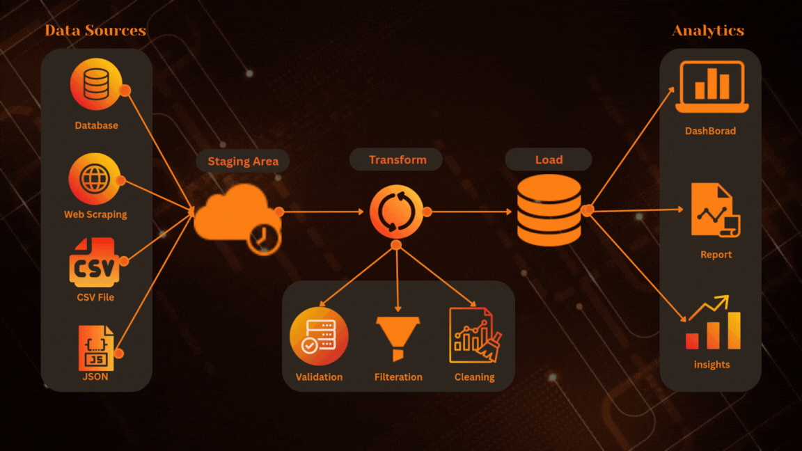
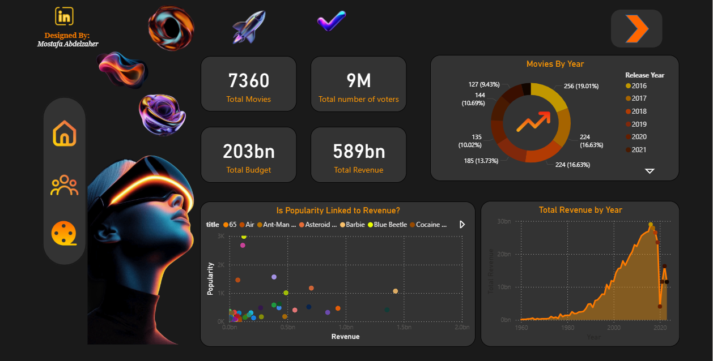
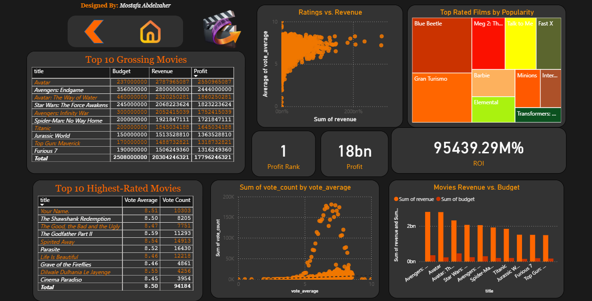
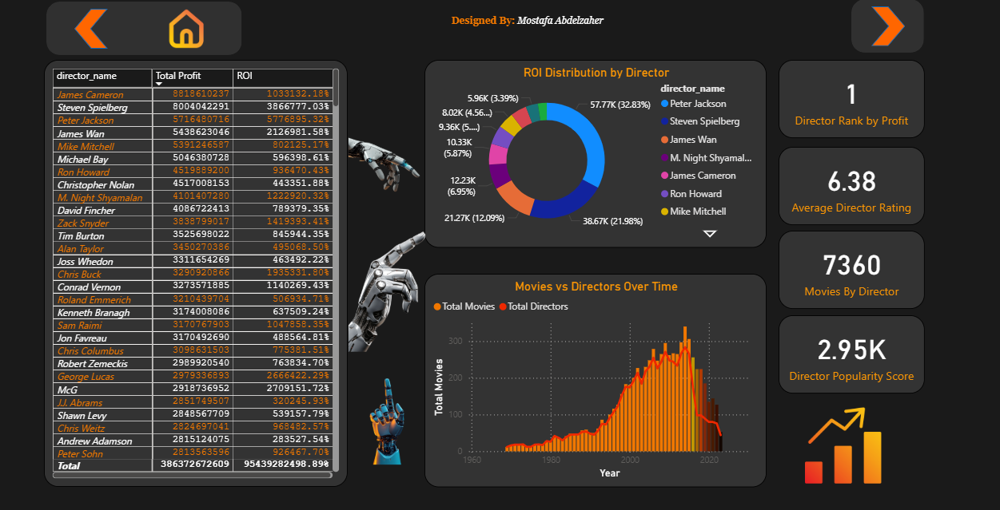

#  ETL Movie Analytics Project

## Overview
This project simulates a **Case Study** where a client wants to open a cinema 
and needs insights about:
- Most profitable movies
- Highest rated movies
- Trends over the years

We built a complete **ETL pipeline** and an interactive **Power BI Dashboard** 
to provide actionable insights.

## 🔄 ETL Pipeline


## 📊 Power BI Dashboard Pages





---

## Project Structure
- `data/raw/` → Raw datasets (IMDB, Kaggle)
- `data/cleaned/` → Cleaned datasets ready for analysis
- `scripts/` → Python scripts for Web Scraping & Data Cleaning
- `notebooks/` → Jupyter Notebooks
- `powerbi/` → Power BI dashboard (`dashboard.pbix`)
- `docs/` → Documentation & screenshots

---

## Tools & Technologies
- **Python**: Pandas, BeautifulSoup
- **Power BI**: Dashboard & Reports
- **GitHub**: Version Control

---

## Insights
- Top profitable movies
- Highest IMDb ratings
- Yearly trends in revenue and reviews

---

## How to Run
1. Clone the repo  
   ```bash
   git clone https://github.com/YourUsername/ETL-Movie-Analytics.git
